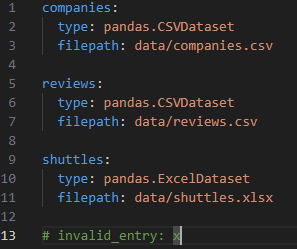

# kedro-datacatalog-user-research

A repo with examples of how I use Kedro's DataCatalog for user research interview


## Use case 1 : DataCatalog for data analytics

I train data analysts to produce more reproducible analysis. I mostly use the [Supercharge your data science notebook with Kedro](https://kedro.org/blog/add-kedro-to-your-data-science-notebook) blog post to introduce them to Kedro, and mostly focus on the ``DataCatalog`` and the ``Dataset`` concepts as standalone components. The configloader is not indtroduced, I jUSt give them a template to put to the beginning of their script. 

```{note}
I will use a python script instead of a notebook for ease of versioning here, but most of the developments are made in a notebook.  
```

Funnily, the use of the catalog through code is considered "advanced use" in kedro documentation.  

### API used**: 
- ``catalog.load()``
- ``catalog.save(data)``

### Most common issues**: 

####Confusion with ``DataSet`` and ``Dataset``

They have been renamed in 0.19, and the blog post still uses the old convention? Since these users have no kedro knowledge and sometimes little python knowledge, this is hard to debug for them:

```bash
DatasetError: An exception occurred when parsing config for dataset 'companies':
Class 'pandas.CSVDataSet' not found, is this a typo?
```

#### Hard to debug and confusing error message if the yaml is invalid 

If they have an invalid entry in their ``catalog.yml``, they got a very confusing error message like ``AttributeError: 'str' object has no attribute 'items'``



#### Unclear error message when kedro-datasets is not installed 

```bash
DatasetError: An exception occurred when parsing config for dataset 'companies':
Class 'pandas.CSVDataset' not found, is this a typo?
```

The root cause here is ``kedro-datasets`` not being installed, but the error message could be more explicit. 

#### No lazy loading forces to install the entire requirements suite

If I install ``kedro-datasets``, I now get the following error message: 

```bash
DatasetError: An exception occurred when parsing config for dataset 'companies':
No module named 'pandas'. Please see the documentation on how to install relevant dependencies for kedro_datasets.pandas.CSVDataset:
```

When they have a lot of data entries and different dependencies and they just want to rerun partially an anaysis, they are sometimes frustrated because they need to install all packages to just load one data source, and they don't have all the proper requirements: why would I need to install excel dependencies to instantiate the ``DataCatalog`` to load a csv which does not need Excel?

#### Difficulty to know how to configure the dataset

They tend do not not know the underlying library to the datasets. They need to be redirected to the right place in the documentation (e.g. [pandas.CSVDataset API doc](https://docs.kedro.org/projects/kedro-datasets/en/kedro-datasets-3.0.0/api/kedro_datasets.pandas.CSVDataset.html))

#### Hard to find the dataset they want

When they have a lot of catalog entries which sis common because they tend to store a lot of intermediate results), they go back and forth with the yaml file to find how they named the dataset. They'd like :
   - autocomplete
   - pretty printing (``print(catalog)`` should give something understandable than a long, *a minima* ``catalog.list()`` and maybe details on the dataset)
   - ability to search datasets, something like ``catalog.search(regex="es$") # output: ["companies", "shuttles"]`` )


#### Credentials

How credentials works are hard to grasp, but this is out of scope here.  

## Use case 2 : DataCatalog for plugin


#### Why use ``catalog._datasets`` over ``catalog._datasets ``? 

Answer : Because I need to override the catalog on the fly and Frozen datasets are to limited. Don't know the difference between ``catalog._datasets[name]`` and ``catalog._get_dataset[name]``


- Loop over all datasets inside a hook : see: https://github.com/Galileo-Galilei/kedro-mlflow/blob/64b8e94e1dafa02d979e7753dab9b9dfd4d7341c/kedro_mlflow/framework/hooks/mlflow_hook.py#L156

- override dataset in the catalog:  https://github.com/Galileo-Galilei/kedro-mlflow/blob/64b8e94e1dafa02d979e7753dab9b9dfd4d7341c/kedro_mlflow/framework/hooks/mlflow_hook.py#L162

- https://github.com/Galileo-Galilei/kedro-mlflow/blob/64b8e94e1dafa02d979e7753dab9b9dfd4d7341c/kedro_mlflow/io/catalog/switch_catalog_logging.py#L1-L4


#### Why use catalog.exists? 

This is a hack to force materilaization with dataset factory pattern : 
https://github.com/Galileo-Galilei/kedro-mlflow/blob/64b8e94e1dafa02d979e7753dab9b9dfd4d7341c/kedro_mlflow/framework/hooks/mlflow_hook.py#L364-L365

#### Extra comment on versioned datasets

Note exactly about the catalog but rather the datasets: 
 https://github.com/Galileo-Galilei/kedro-mlflow/blob/64b8e94e1dafa02d979e7753dab9b9dfd4d7341c/kedro_mlflow/io/artifacts/mlflow_artifact_dataset.py#L51-L53


#### Catalog.add and catalog.add_feed_dict

Create a catalog programatically: 

https://github.com/Galileo-Galilei/kedro-mlflow/blob/64b8e94e1dafa02d979e7753dab9b9dfd4d7341c/kedro_mlflow/mlflow/kedro_pipeline_model.py#L108C1-L116C84

#### catalog.shallow_copy()

Mostly to avoid interaction when refilling a catalog based on a reference 
https://github.com/Galileo-Galilei/kedro-mlflow/blob/64b8e94e1dafa02d979e7753dab9b9dfd4d7341c/kedro_mlflow/mlflow/kedro_pipeline_model.py#L194C47-L194C62


#### Serialization

Serialization is an issue because I often pickle a catalog (mostly as part of a mlflow model), see https://github.com/Galileo-Galilei/kedro-mlflow/blob/64b8e94e1dafa02d979e7753dab9b9dfd4d7341c/kedro_mlflow/mlflow/kedro_pipeline_model.py#L54. If *any* attribute change, I won't be able to load the model with a newer kedro version., e.g.:  

```python
# pseudo code
pickle.dumps(catalog)
pickle.loads(catalog) # this will fail if I reload with a newer kedro version and any attributes (even private) has changed. This breaks much more often that we should expect. 
```

It would be much more robust to be able to do this: 

```python
# pseudo code
catalog.serialize("path/catalog.yml") # name TBD: serialize? to_config? to_yaml? to_json? to_dict? 
catalog.deserialize(catalog) # much more robust since it is not stored as python object -> maybe catalog.from_config? 
```